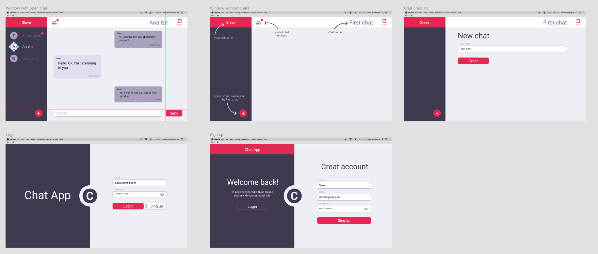
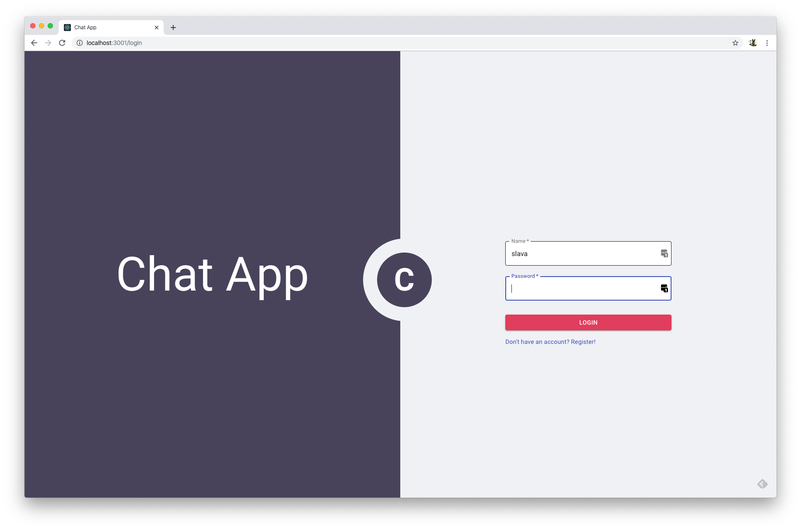
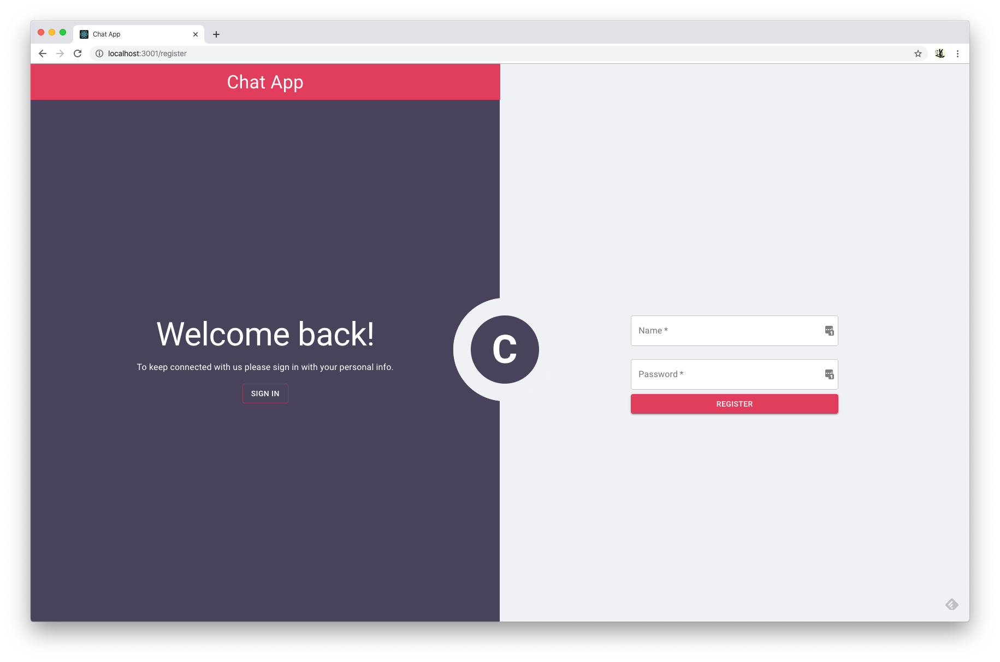
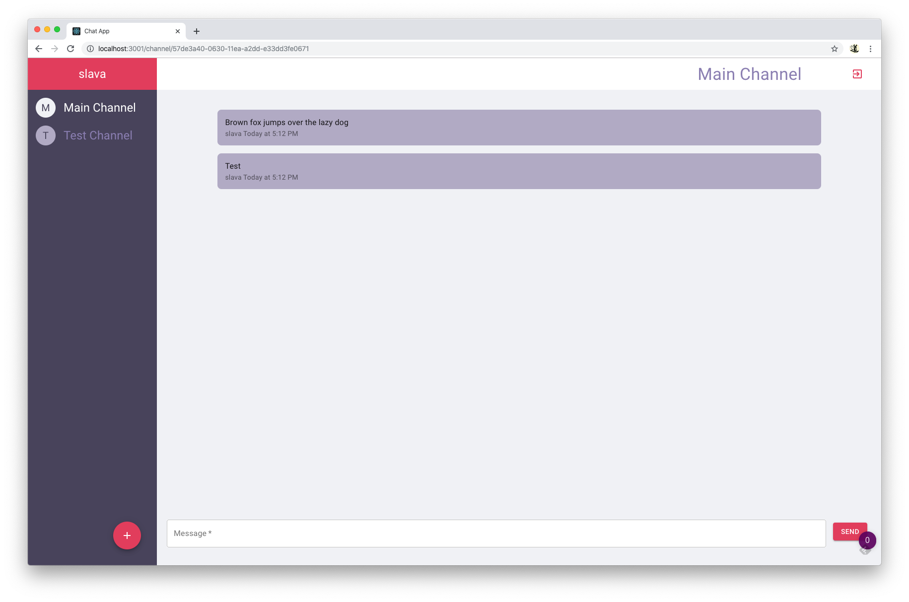

---

title: "Building chat with GraphQL server and React client."
date: "2019-10-28T18:56:00Z"

---

There are tons of different UI libraries and frameworks and often just to try a new one you ended up with “Hello world!” or simple TODO app.

I wanted something more complex but not to much. Look inside but don't drown, see the framework from different angles. This could be level of documentation, support and integrations with other libraries, working with state/store, communication with the server, etc. But again I don’t want this to be to complex.

In my opinion the Chat application fits perfectly for this needs. So lets build a simple chat server and a client.

## Graphql Chat Server

As a GraphQL server I choose [Apollo](https://www.apollographql.com/docs/apollo-server/).


Fist of all lest establish a graphql schema:

```gql

  type User {
    username: String!
    password: String!
  }

  type Channel {
    id: ID!
    name: String!
    messages: [Message]!
  }

  type Message {
    user: User!
    content: String!
    createdAt: Float!
  }

  type Query {
    channels: [Channel]
    channel(id: ID!): Channel
    currentUser: User
  }

  type Subscription {
    messageAdded(channelId: ID!): Message
  }

  type LoginResponse {
    token: String
    user: User
  }

  type Mutation {
    register(username: String!, password: String!): User!
    login(username: String!, password: String!): LoginResponse!
    createChannel(name: String!): Channel!
    createMessage(channelId: ID!, content: String!): Message!
  }
```

This is a very basic schema but it's enough for know.

* User could register with an email and password.
* Login with an email and password.
* Fetch all available channels (Rooms) or create a new one.
* Write and send a new message to the channel.

As small an additional feature there is a Subscription called <span style="color:coral">messageAdded</span>. Client could subscribe through GraphqlQL (WebSockets) and listen when there are new messages in the channel and refresh content accordingly.

There are no external storage connected which means all the values are stored in memory so all the information will be lost after server restart. (This part could be enhanced with Firebase or just by storing data in the file, etc.)

You could download server from here:
https://github.com/slavik925/chat-graphql-server/

## UI/UX for our Chat App

I asked my wife if she is able to help me a bit with the UI part and this ended up in series of few nice mockup of out chat app.



We got everything we need so lets proceed and write the UI.

## Writing the Client on React


### Why React?

It’s simple - because React is my main tool currently. But the idea is that in future I think to create something similar using the other libraries (Angular, Vue, Svelte, etc.) and it's good to have something you know well to compare with new things. Not just to imagine but compare based on the real experience.
#### Create React App

To generate a new React App with typescript support run:

```
npx create-react-app chat-app --typescript
```

Then let's add UI toolkit. I will be using [Material UI](https://material-ui.com/).

```
npm install @material-ui/core
```

Also we will require [Apollo Client](https://www.apollographql.com/docs/react/):
```
npm install apollo-client apollo-cache-inmemory apollo-link-http graphql-tag graphql --save
```

And the last important touch is [React Router](https://reacttraining.com/react-router/web/guides/quick-start) for the navigation:

```
npm install react-router-dom
```

This is ours core minimum.

### Communication with the Server

Setting up Apollo link to properly communicate with the API: 

```js
const authLink = setContext((_, { headers }) => {
  // get the authentication token from local storage if it exists
  const token = localStorage.getItem('token');
  // return the headers to the context so httpLink can read them
  return {
    headers: {
      ...headers,
      Authorization: token ? `Bearer ${token}` : ''
    }
  }
});
```

 Next we will render our app wrapped with ApolloProvider:

 ```javascript
const client = new ApolloClient({
  link,
  cache: new InMemoryCache()
});

 ReactDOM.render(<ApolloProvider client={client}><App /></ApolloProvider>, document.getElementById('root'));
 ```

 ### Setting up the routes and main app

 The App module itself is very straightforward .

 ```javascript
 const App = () => {
  const { data, loading, error } = useQuery(CURRENT_USER, { fetchPolicy: "network-only" });

  if (loading) return <p>Loading...</p>;
  if (error) return <p>Error :(</p>;

  const currentUser = (data && data.currentUser) || null;

  return (
    <CurrentUserContext.Provider value={currentUser}>
      <MuiThemeProvider theme={theme}>
        <Router>
          <Route path="/" component={!currentUser ? MainPage : ChatPage} />
          {
            !currentUser && <Route path="/register" component={RegisterPage} />
          }
        </Router>
      </MuiThemeProvider>
    </CurrentUserContext.Provider>
  );
}
```

We are fetching the current user and setting one in the React context.

Then wrap everything with slightly modified react material ui theme (mostly colors).

And adding a route for register user and rending Main page or Chat page depending if the user is logged in our no.

### What next?

I not going to describe every piece, you could browser client code from here - https://github.com/slavik925/chat-graphql-client.

There are a lot of thinks that could be done better. For example there are lack of tests, components could be divided better and the types are not everywhere. But it give an idea how the app is written/look using the React library.

The whole point of this is to create a quick sketch to see how are you comfortable with the technology you picket? What is it offers? Who many problems you faced? How easy you could solve this problems?

Here are the few pic how the Chat App looks.








### Conclusion

I suggest you to grab the GraphqQL server and try to write something similar. Just pick any UI library you want to lear: Angular, Vue, Svelte, Handlebars or even on pure js.

Here are my few conclusion about react:

The main pros:

* It feels that you are wring normal HTML with JS, everything looks pretty naturally.

* Create React app is an amazing starter with TS support out of the box and have placeholders almost for everything.

* Apollo helps a lof by providing clients, hooks, etc.

* Components are well isolated. You could separate everything. (Logic could be placed in the hooks for example).

* CSS in JS - I like this, much faster, no need to produced additional files. And the component feels more complete of holding everything together.

* State could be managed with context across the app without any additional libs.

Some of the cons:

* You need to know what you are doing. If you create bad hierarchy of components you could refresh entire page just with a simple action intended for some small piece of UI.

* Some times it gives to much granularity that leads to a lot of typing :). Want a handler for the input? Create a state, function, connect function to on change, pass the state update function. Have multiple inputs? Prepare to copy and paste. Don't want to copy and paste? Create your own solution. 

Next time I will try to write the same chat app but using other UI framework. Looking forward to see the results.