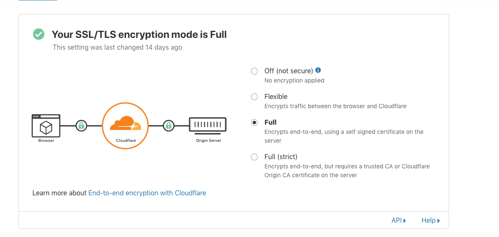

---

title: "Как развернуть свой проект и не стать devops'ом: дружим heroku с cloudflare."
date: "2019-10-08T12:00:00Z"

---

#### TL;DR

> Главная фишка в том, как можно бесплатно прикрутить SSL на heroku. Также немного рассказал, как перенёс все с digitalocean на heroku, да еще и за бесплатно прикрутил SSL. 

### Начало

Начнём с обычной ситуации начинающего стартапера: ты пилишь свой продукт, доменное имя уже куплено, репозитории созданы, команда пыхтит и что-то там накодано. Пришло время показать достигнутый результат пользователям/инвесторам.

Мы конечно же кул хацкеры и всё можем сделать сами. Берем digitalocean и поехали.

#### Что, могло пойти не совсем так?

И так, всего за 10$ ты получаешь «дроплет» с 2гб RAM и сколько-то там места на HDD. 

Вот оно, счастье совсем близко, осталось задеплоить проект и…
Ах да задеплоить, только вот деплоить не особо есть куда так, как у нас голый линукс.

#### Digitalocean или сам себе devlops.

Проект написан на Rails и оказалось, что просто скопировать все файлы на дроплет не вариант :).

Не буду вдаваться во все подробности (тут можно отдельно три статьи еще написать) но, как оказалось настраивать нужно довольно много и практически все через возню с консолью.

Коротко, в настройку входило:
- настройка самого «дроплета» (пользователи, ssh, ключи, файрвол, ruby, etc)
- capistrano для деплоя Rails
- nginx (риверс прокси)
- letsencrypt для ssl
- posrgresql

За этим всем приходиться постоянно смотреть, переодически накатывая последние апдейты, делая перезагрузки и мониторя логи.  

На саму настройку всего этого добра суммарно ушло несколько недель. А в случае проблем делаешь bash history и смотришь, где вообще что, лежит и что, ты там вообще последний раз делал. Даже само обновление версии ruby то ещё приключение. 

Хорошо если бы этими вещами занялся кто-то, а ещё лучше автоматизировать весь процес. Лень писать скрипты и заниматься этим всем самому, а искать специального человека - не дешево. 

### Heroku приходить на помощь.

> Heroku — облачная PaaS-платформа, поддерживающая ряд языков программирования.
>
> https://ru.wikipedia.org/wiki/Heroku

В перспективе возможно не самое дешевое решение, но мы воспользуемся бесплатной опцией.

И так что нужно? Регистрируемся, затем вписываем название нашей аппликации и получаем “ссылку на репозиторий”, затем пушаем туда свой код и все.
Как все? Вот так все. 

В моем случае с Rails приложение собралось и стало сразу доступно по адресу
`app-name.herokuapp.com`

#### Счастье близко - но есть нюанс

Heroku не предоставляет возможности работы с почтой, файлами и базой данный из коробки. Поэтому кое-что настроить все-таки придется.

Почти все дополнительные вещи в heroku настраиваются через [аддоны](https://elements.heroku.com/addons). 
Для базы данных мне понадобился [heroku-postgresql](https://elements.heroku.com/addons/heroku-postgresql), а для почты [mailgun](https://elements.heroku.com/addons/mailgun).

К слову, бесплатная версия [heroku-postgresql](https://elements.heroku.com/addons/heroku-postgresql) позволяет сохранять до 10000 тысяч строк.

А для файлов вообще можно обойтись без аддона, отлично подойдет [Amazon S3](https://aws.amazon.com/s3/).

### Самая интересная часть (Goddaddy & Heroku & SSL)

У нас в распоряжении уже был домен, который нужно было прикрутить, а сам процесс подключения домена хорошо описан в доке:
https://devcenter.heroku.com/articles/custom-domains

Добавляем домен к heroku:

Но к сожалению (и моему удивлению) heroku не имеет постоянного IP адреса, что означало невозможность указать в godaddy запись типа «А» чтоб всё просто заработало из коробки.

Ну что-ж подумал я, мы же все ещё хацкеры - делаем редирект.

Быстро настраиваем редирект с godadyy на наш herokapp и все бы классно, но SSL мать его! Конечно же при таком редиректе всё переставало работать через https. Как оказалось нужно покупать ещё и SSL сертификат у godaddy.
"Это фиаско, братан" - продумал я.

### Как использовать бесплатный SSL от Heroku и Cloudsflare.

Пройдя не одну поисковую выдачу в «утка-утка иди» и перелопатив кучу статей на «среднем» я таки нашёл возможность. 

Этой возможностью стал [Cloudflare](https://www.cloudflare.com/). Он дает бесплатный SSL сертификат и может полностью принять на себе управление доменом.

Так, как по умолчанию наш `app.herokuapp.com` уже имеет деволтный SSL сертификат, мы можем его использовать, подключив только cloudflare.

Дело за малым, регаемся на cloudflare. Далее в godaddy поинтим неймспейси на cloudflrare:

Там в свою очередь импортируем все DNS записи и добавляем необходимые:

Врубаем SSL:

### Итог

Теперь при заходе на https://ltube.net и на https://ww.ltube.net - cloudflare будет проксировать на https://ltube.herokuapps.com (используя SSL).

В итоге главная цель достигнута - используя heroku абсолютно не нужно заниматься долгой и мучительной конфигурацией инстанции сервисов и тп. Пушнул и деплой пошёл. Ну и всё за бесплатно.

Основной минус — это цена. При масштабировании все этого добра придётся платить за каждый сервис отдельно: за базу, S3, heroku. Но мне, кажется, это всё равно дешевле чем менеджить целый дроплет, да и масштабироваться на порядок легче 